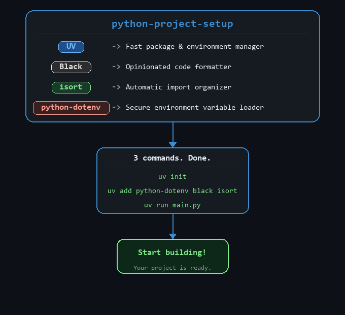

# 🐍 Python Project Setup

A shell project for Python beginners using modern tooling: **UV** for package management, **Black** for formatting, and **isort** for import sorting.

> [!NOTE]
> 📢 **Disclaimer:** This is a **learning-purpose project** shared as a public repository.
> It is intended purely for educational reference. Please **do not raise issues, submit PRs, or disturb the repo** — just read, learn, and build your own! 🙏

---



---

## 🧰 Tools Overview

### ⚡ UV — Fast Python Package Manager
UV is an extremely fast Python package and project manager written in Rust. It replaces `pip`, `pip-tools`, `pyenv`, and `venv` in a single tool.

### 🖤 Black — Python Code Formatter
Black is an uncompromising Python code formatter. It enforces a consistent style by reformatting your code automatically, so you never argue about formatting again.

### 🔀 isort — Import Sorter
isort automatically sorts and organizes Python imports alphabetically and by section (standard library, third-party, local), keeping them clean and consistent.

### 🔐 python-dotenv — Environment Variable Loader
python-dotenv loads environment variables from a `.env` file into `os.environ`, keeping secrets and config (API keys, database URLs, etc.) out of your source code.

---

## 🔁 Clone the Repo

If you want to follow along locally, clone this repository first:

```bash
git clone https://github.com/sakhsen/python-project-setup.git
cd python-project-setup
```

---

## 🚀 Setup Steps

### 1. Install UV
```bash
pip install uv
```

### 2. Initialize the project

If you already cloned this repo and are inside the project folder:
```bash
uv init
```

If you are starting a brand new project from scratch:
```bash
uv init my-project
cd my-project
```

`uv init` scaffolds the following files:

```
my-project/
├── .python-version     # Pins the Python version used by this project
├── pyproject.toml      # Project metadata, dependencies, and tool config
├── README.md           # Empty readme placeholder
└── main.py             # A minimal "Hello, World!" entry point
```

| 📄 File | 📝 Purpose |
|---|---|
| `.python-version` | Tells UV (and pyenv) which Python version to use, e.g. `3.12` |
| `pyproject.toml` | The single source of truth — replaces `setup.py`, `requirements.txt`, and `setup.cfg`. Holds your dependencies, dev dependencies, and tool settings (Black, isort, etc.) |
| `README.md` | Placeholder for your project documentation |
| `main.py` | Minimal starter script so you can run `uv run main.py` immediately |

> 📦 Once you run `uv add ...`, UV also creates:
> - `uv.lock` — an exact lockfile of every resolved dependency (commit this to git ✅)
> - `.venv/` — the virtual environment folder (add to `.gitignore` 🚫)

### 3. Install all packages

**macOS / Linux (bash/zsh):**
```bash
uv add python-dotenv && uv add --dev black isort
```

**Windows (PowerShell):**
```powershell
uv add python-dotenv; uv add --dev black isort
```

> 💡 **No need to manually create or activate a virtual environment!**
> UV automatically creates and manages the `.venv` folder the moment you run `uv add` or `uv run`.
> Simply use `uv run <script.py>` to run your code — UV handles the rest.
>
> Activate manually **only if** you want to use `python` or `pip` directly in the terminal:
> ```bash
> .venv\Scripts\activate      # Windows
> source .venv/bin/activate   # macOS / Linux
> ```

### 4. Create a `.env` file
```bash
# .env
API_KEY=your_api_key_here
DATABASE_URL=your_db_url_here
```

### 5. Load environment variables in your code
```python
from dotenv import load_dotenv
import os

load_dotenv()

api_key = os.getenv("API_KEY")
```

### 6. Format your code with Black 🖤
```bash
black .
```

### 7. Sort your imports with isort 🔀
```bash
isort .
```

### 8. Run both formatters together ✨

**macOS / Linux (bash/zsh):**
```bash
black . && isort .
```

**Windows (PowerShell):**
```powershell
black .; isort .
```

---

## 🛡️ .gitignore

This repo includes a comprehensive `.gitignore` to keep your git history clean. Here's a quick summary of what gets ignored:

| Category | What's ignored |
|---|---|
| 🐍 Python | `__pycache__/`, `*.pyc`, `.eggs/`, `dist/`, `build/` |
| 📦 Virtual env | `.venv/`, `venv/`, `env/` |
| 🔐 Secrets | `.env`, `.envrc` |
| 🧪 Tests & coverage | `.pytest_cache/`, `.coverage`, `htmlcov/` |
| 🤖 LangChain | `.langchain/`, `langchain.db`, `.langsmith/` |
| 🗃️ Vector stores | `faiss_index/`, `chroma_db/`, `*.faiss`, `*.pkl` |
| 🧠 LLM model files | `*.gguf`, `*.ggml`, `*.safetensors`, `*.bin`, `*.pt`, `*.onnx` and more |
| 🤗 Hugging Face cache | `.cache/huggingface/`, `hf_cache/` |
| 🛠️ IDE | `.vscode/` (optional), `.idea/` (optional) |

> 📄 For the full list, refer to the [`.gitignore`](./.gitignore) file in the root of this repo.

---

## 📋 Quick Reference

| 🛠️ Tool      | 📌 Purpose                     | 💻 Command               |
|---------------|--------------------------------|--------------------------|
| uv            | Package & environment manager  | `uv add <pkg1> <pkg2> etc` |
| black         | Code formatter                 | `black .`                |
| isort         | Import sorter                  | `isort .`                |
| python-dotenv | Load `.env` into `os.environ`  | `load_dotenv()`          |
